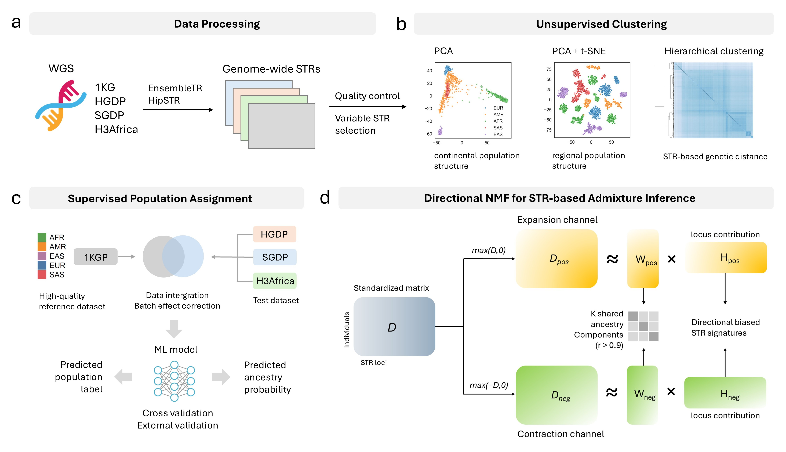
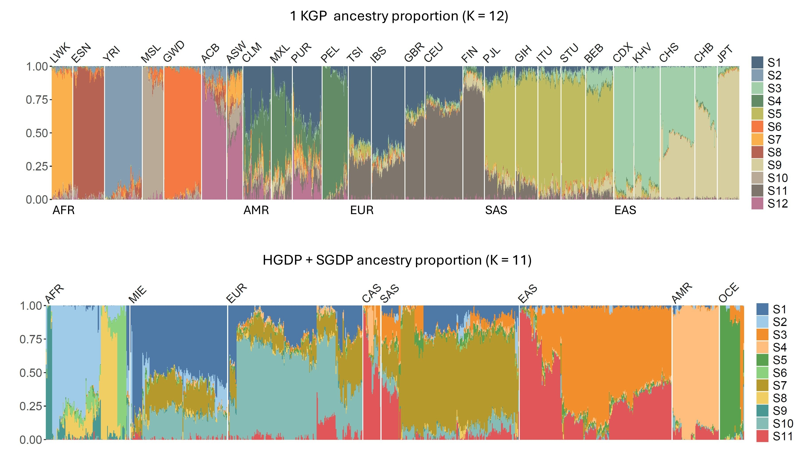

# Population Structure Inference using Genome-wide STR variations

This repository contains comprehensive analyses for genome-wide Short Tandem Repeat (STR) variations in human populations. 

<p align="center">
  
</p>

The pipeline was applied to the following datasets:
+ 1000 Genomes Project (1KGP)
+ Human Genome Diversity Project (HGDP)
+ Simon Genome Diversity Project (SGDP)
+ H3Africa

## 1. Input Formats

Before running the pipeline, ensure the following input files are available.

###  STR Genotyping VCFs

STR genotyping VCF for 1KGP and H3Africa are obtained from:

- **EnsembleTR**
  GitHub: https://github.com/gymreklab/EnsembleTR  
  (Multi-caller consensus STR genotyping; HipSTR calls extracted via `METHODS[2] == 1`.)
  
STR genotypes of HGDP and SGDP are generated using HipSTR:

- **HipSTR**:  
*links to be added*


### Sample metadata

Columns should include:

- Sample ID (used to align with matrix columns)
- Continental population labels
- Regional population labels


## 2. Key Components of the Pipeline

All core analysis scripts are located in the `scripts/` directory. 

### STR Matrices and Overlap Between Datasets

#### STR Matrix Construction
`preprocess_vcfs.py`
Scripts convert EnsembleTR or HipSTR VCFs into per-chromosome and genome-wide STR matrices.

Main steps:
- parse STR genotypes (`NCOPY`, `GB`)
- filter loci by motif period and variance
- optional: keep only HipSTR calls from EnsembleTR (`METHODS[2] == 1`)
- produce:
  - `str_info.tsv` (metadata for STR loci)
  - `str_matrix.tsv` (samples × STR loci)

#### Cross-dataset STR Harmonization
`integrate_cohorts.py`
Used when merging data from 1KGP, HGDP, SGDP, and H3Africa.

Steps:
- identify overlapping loci using PyRanges  
- apply variance filtering to each dataset  
- remove batch-driven loci using population-level STR mean comparisons  
- output merged STR matrices aligned to the same loci

This enables joint population structure analyses.

### Population Structure Analysis (STR vs SNP)
`unsupervised_clustering.py`, `genetic_distances.py`, `geo_distances.py`
These provide a direct comparison of population structure resolution between STRs and SNPs.

Features:
- PCA-based dimensionality reduction
- K-means clustering 
- Adjusted Rand Index (ARI) evaluation at:
  - continental population levels
  - regional population levels
- hierarchical clustering of genetic distance matrices (STRs and SNPs)
- comparison of STR/SNP distances to geographic distances using Mantel tests

### Supervised Population Assignment (STR vs SNP)
`supervised_assignment.py`
Two classifiers are implemented:
- Random Forest
- Naive Bayes

Outputs include accuracy metrics at both continental and regional levels for STRs and SNPs.


### Directional NMF for STR-based Admixture Inference
`dNMF.py`
The model assumes ancestral components are encoded jointly in STR expansions and contractions.

Input:
- STR genotype matrices from 1KGP and HGDP+SGDP

Output:
- Ancestry coefficient matrices
- STR contribution matrices 

Using dNMF, we detected:
- K = 12 ancestral components in 1KGP  
- K = 11 ancestral components in HGDP+SGDP  


<p align="center">
  
</p>


### Ancestry-informative STR Signatures Analysis
`STR_signatures.py`
- Identify top STR loci per direction per component 
- Define direction-specific STR signatures
- Perform enrichment tests for STR motif lengths and genomic regions

## 3. Notebooks

This repository includes Jupyter notebooks and R scripts for generating figures in the `notebooks/` and `R_scripts/` directory.

## 4. Dependencies

- Python 3.10 or newer
- numpy
- pandas
- scipy
- scikit-learn
- statsmodels
- pyranges

Installable via pip or conda, for example:

```bash
pip install numpy pandas scipy scikit-learn statsmodels pyranges
```

## 5. Citation